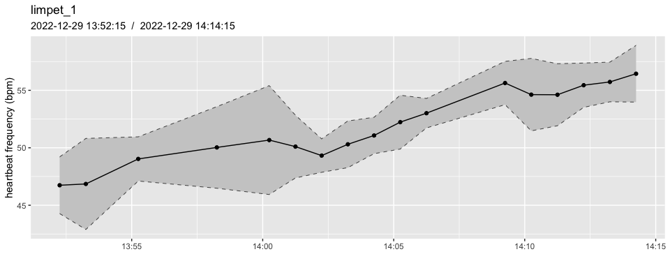

<!-- README.md is generated from README.Rmd. Please edit that file -->

# heartbeatr

<!-- badges: start -->
<!-- badges: end -->

An R package for processing data and automatically assessing cardiac
frequency, specifically designed for use with PULSE systems
(www.electricblue.eu/pulse).

## Installation

You can install the development version of **heartbeatr** from
[GitHub](https://github.com/) with:

``` r
# install.packages("devtools")
devtools::install_github("coastalwarming/heartbeatr")
```

## Examples

List PULSE files to be read:

``` r
library(heartbeatr)
# but make sure they correspond to a single experiment/device
# ...here we use the package's example data
paths <- pulse_example("RAW_original_")
paths
#> [1] "/Library/Frameworks/R.framework/Versions/4.3-arm64/Resources/library/heartbeatr/extdata/RAW_original_20221229_1350.CSV"
#> [2] "/Library/Frameworks/R.framework/Versions/4.3-arm64/Resources/library/heartbeatr/extdata/RAW_original_20221229_1400.CSV"
```

There are two ways to read and process those data:

``` r
# step by step
pulse_data_sub   <- pulse_read(paths, msg = FALSE)
pulse_data_split <- pulse_split(
   pulse_data_sub,
   window_width_secs = 30,
   window_shift_secs = 60,
   min_data_points = 0.8, 
   msg = FALSE
   )
pulse_data_split <- pulse_optimize(pulse_data_split,
                                   target_freq = 40,
                                   bandwidth = 0.2)
heart_rates <- pulse_heart(pulse_data_split, msg = FALSE)

# or calling a single wrapper function
heart_rates <- PULSE(
  paths,
  # channels s5 to s10 are empty in the example data
  discard_channels  = paste0("s", 5:10), 
  window_width_secs = 30,
  window_shift_secs = 60,
  min_data_points   = 0.8,
  target_freq = 40,
  bandwidth   = 0.2,
  msg = FALSE
  )
```

Once processed, PULSE data is stored as a tibble with an average heart
rate frequency for each channel/split window. The time is relative to
the mid-point of the window. Frequencies are expressed in Hz and BPM. In
addition, the following information is also provided, which can be used
to classify or filter the data: **n**, the number of identified heart
beats, **sd**, the standard deviation of the intervals between each pair
of consecutive peaks, **ci**, the confidence interval of the Hz estimate
(hz ± ci), and **bpm_ci**, the confidence interval of the BPM estimate
(bpm ± bpm_ci).

``` r
heart_rates
#> # A tibble: 95 × 9
#>    id       time                data         n    hz    sd    ci   bpm bpm_ci
#>    <fct>    <dttm>              <list>   <int> <dbl> <dbl> <dbl> <dbl>  <dbl>
#>  1 limpet_1 2022-12-29 13:51:15 <tibble>    24 0.789 0.045 0.088  47.4   5.28
#>  2 limpet_1 2022-12-29 13:52:15 <tibble>    23 0.779 0.021 0.041  46.7   2.47
#>  3 limpet_1 2022-12-29 13:53:15 <tibble>    24 0.781 0.034 0.066  46.9   3.96
#>  4 limpet_1 2022-12-29 13:54:15 <tibble>    25 0.811 0.089 0.174  48.7  10.4 
#>  5 limpet_1 2022-12-29 13:55:15 <tibble>    25 0.817 0.016 0.032  49.0   1.92
#>  6 limpet_1 2022-12-29 13:56:15 <tibble>    24 0.81  0.18  0.353  48.6  21.2 
#>  7 limpet_1 2022-12-29 13:57:15 <tibble>    26 0.848 0.069 0.135  50.9   8.13
#>  8 limpet_1 2022-12-29 13:58:15 <tibble>    26 0.834 0.03  0.059  50.0   3.55
#>  9 limpet_1 2022-12-29 13:59:15 <tibble>    27 0.869 0.056 0.11   52.1   6.57
#> 10 limpet_1 2022-12-29 14:00:15 <tibble>    25 0.845 0.04  0.079  50.7   4.74
#> # ℹ 85 more rows
```

The raw data corresponding to each split window is still available.

``` r
heart_rates$data[[1]]
#> # A tibble: 1,200 × 3
#>    time                  val peak 
#>    <dttm>              <dbl> <lgl>
#>  1 2022-12-29 13:51:00 1093. FALSE
#>  2 2022-12-29 13:51:00 1093. FALSE
#>  3 2022-12-29 13:51:00 1094. FALSE
#>  4 2022-12-29 13:51:00 1098. FALSE
#>  5 2022-12-29 13:51:00 1104. FALSE
#>  6 2022-12-29 13:51:00 1114. FALSE
#>  7 2022-12-29 13:51:00 1128. FALSE
#>  8 2022-12-29 13:51:00 1145. FALSE
#>  9 2022-12-29 13:51:00 1163. FALSE
#> 10 2022-12-29 13:51:00 1180. FALSE
#> # ℹ 1,190 more rows
```

You can easily use parallel computing with **heartbeatr** - just
configure your R session properly **BEFORE** applying the PULSE
workflow:

``` r
# this shows how your session is currently configured 
#   (typically defaults to "sequential", i.e., not parallelized)
future::plan()
#> sequential:
#> - args: function (..., envir = parent.frame())
#> - tweaked: FALSE
#> - call: NULL

# to make use of parallel computing (highly recommended)
future::plan("multisession")
future::plan()
#> multisession:
#> - args: function (..., workers = availableCores(), lazy = FALSE, rscript_libs = .libPaths(), envir = parent.frame())
#> - tweaked: FALSE
#> - call: future::plan("multisession")
```

The raw data underlying the heart rate frequency estimate (hz) can be
inspected:

``` r
# the split window for channel "limpet_1" closest to the target date 
#   provided with target_time is shown in the center:
#   - 2 more windows are shown before/after the target (because range was set to 2)
#   - red dots show where the algorithm detected a peak
pulse_plot_raw(heart_rates, 
               ID = "limpet_1", 
               target_time = "2022-12-29 13:55", 
               range = 2)
```


Beware of bad data - estimates of heart rate are always produced,
regardless of the quality of the underlying data, but they may not be
usable at all if the quality of that data is too poor.

``` r
# the channel "limpet_2" contains poor-quality data, where visual inspection 
# clearly shows that the heart rate wasn't captured in the signal (lack of 
# periodicity and inconsistent intervals between the peaks identified)
pulse_plot_raw(heart_rates, 
               ID = "limpet_2", 
               target_time = "2022-12-29 13:55", 
               range = 2) 
```


A quick overview of the result of the analysis of the data from all
channels:

``` r
# note that one could easily overlook the wider confidence intervals in all channels 
# other than "limpet_1" and erroneously continue analysing the output of the 
# pulse-processing algorithm - when in fact we have already determined that data 
# recorded in the channel "limpet_2" is too poor (the same is true for the other 
# channels as well).
pulse_plot(heart_rates)
```


The number of data points can be reduced:

``` r
heart_rates_binned <- pulse_summarise(heart_rates, 
                                      fun = mean, 
                                      span_mins = 3, 
                                      min_data_points = 0.8)
pulse_plot(heart_rates_binned)
```


A more detailed view of the channel “limpet_1”, showing the Confidence
Interval for each estimate of heart rate.

``` r
pulse_plot(heart_rates, 
           ID = "limpet_1", 
           smooth = FALSE, 
           bpm = TRUE)
```


Data points exceeding an arbitrary standard deviation can easily be
removed. This is useful when dealing with long series of continuous data
which were already collected with the intention to discard portions of
data with higher variability which may be indicative of lower quality.

``` r
# arbitrary threshold
max_sd <- 0.04
filtered_heart_rates <- dplyr::filter(heart_rates, sd <= max_sd)

pulse_plot(filtered_heart_rates, 
           ID = "limpet_1", 
           smooth = FALSE, 
           bpm = TRUE)
```


