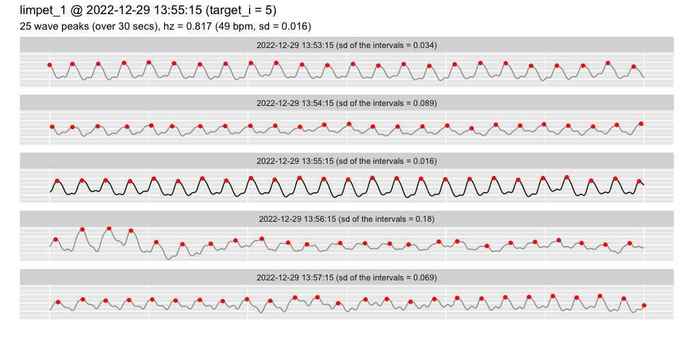
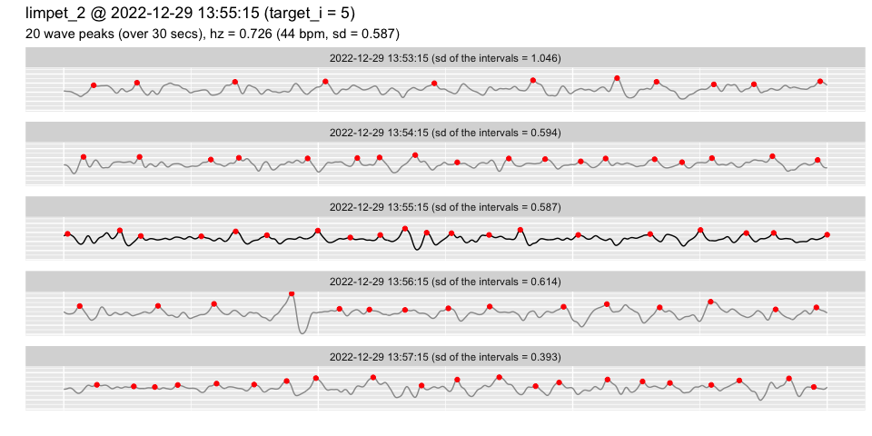
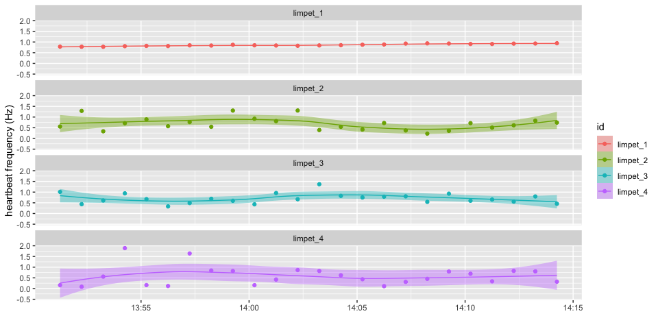
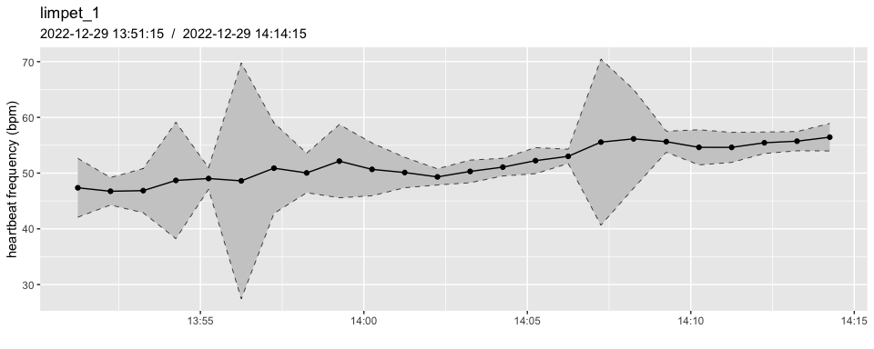
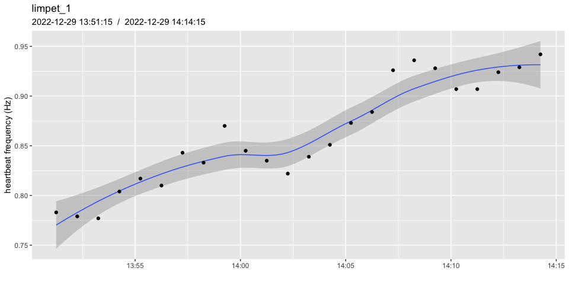
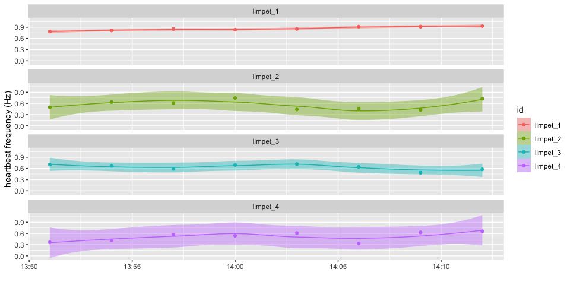
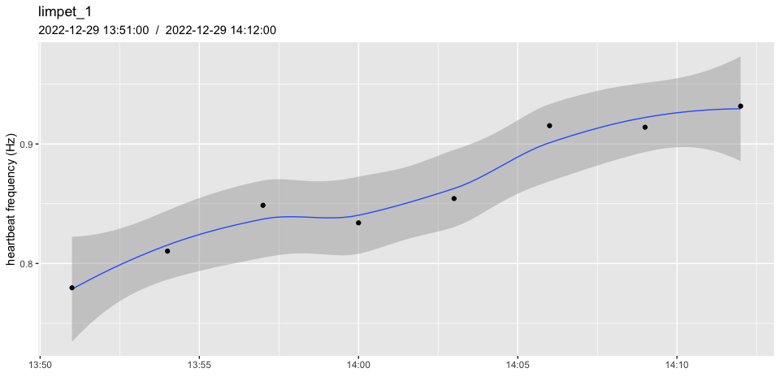

<!-- README.md is generated from README.Rmd. Please edit that file -->

# heartbeatr

<!-- badges: start -->
<!-- badges: end -->

An R package for processing data and automatically assessing cardiac
frequency, specifically designed for use with PULSE systems
(www.electricblue.eu/pulse).

## Installation

You can install the development version of **heartbeatr** from
[GitHub](https://github.com/) with:

``` r
# install.packages("devtools")
devtools::install_github("coastalwarming/heartbeatr")
```

## Load heartbeatr

``` r
library(heartbeatr)
```

## List PULSE files to be read

``` r
# here we use the package's example data
paths <- pulse_example("RAW_original_")
basename(paths)
#> [1] "RAW_original_20221229_1350.CSV" "RAW_original_20221229_1400.CSV"
```

``` r
# to use your own data just get the paths to your target files
paths <- dir("folder_with_your_files")

# but make sure they correspond to a single experiment/device !!
# if in doubt, check the helpfile for the PULSE() function 
#  [section: One experiment] to better understand what this means
?PULSE 
```

## Read and process your dataset - step-by-step

Use the step-by-step approach to better understand, debug or fine-tune
your workflow

``` r
pulse_data_sub <- pulse_read(
  paths, 
  msg = FALSE
  )

keep_cols <- !(colnames(pulse_data$data) %in% paste0("s", 5:10))
pulse_data$data <- pulse_data$data[,keep_cols] # discarding unused channels

pulse_data_split <- pulse_split(
   pulse_data,
   window_width_secs = 30,
   window_shift_secs = 60,
   min_data_points = 0.8, 
   msg = FALSE
   )

pulse_data_optimized <- pulse_optimize(
  pulse_data_split,
  interpolation_freq = 40,
  bandwidth = 0.2,
  raw_v_smoothed = TRUE
  )

heart_rates <- pulse_heart(
  pulse_data_optimized, 
  N  = 3, 
  SD = 0.5,
  msg = FALSE
  )

heart_rates <- pulse_doublecheck(
  heart_rates,
  N  = 3, 
  SD = 0.5,
  correct = TRUE
  )
```

## A tiddier option - single wrapper function

The wrapper function is much simpler to use and delivers exactly the
same results (*it is just executing the step-by-step workflow at once*).

``` r
heart_rates2 <- PULSE(
  paths,
  # channels s5 to s10 are empty in the example data
  discard_channels  = paste0("s", 5:10), 
  window_width_secs = 30,
  window_shift_secs = 60,
  min_data_points   = 0.8,
  interpolation_freq = 40,
  bandwidth = 0.2,
  N  = 3, 
  SD = 0.5,
  msg = FALSE
  )

identical(heart_rates, heart_rates2)
#> [1] TRUE
```

Once processed, PULSE data is stored as a tibble with an average heart
rate frequency for each channel/split window. The time is relative to
the mid-point of the window. Frequencies are expressed in Hz (*multiply
by 60 to get BPM*). In addition, the following information is also
provided, which can be used to classify or filter the data: **n**, the
number of identified heart beats, **sd**, the standard deviation of the
intervals between each pair of consecutive peaks, and **ci**, the
confidence interval of the Hz estimate (hz ± ci).

``` r
heart_rates
#> # A tibble: 96 × 13
#>        i smoothed id       time                data         n    sd    hz    ci
#>    <int> <lgl>    <chr>    <dttm>              <list>   <int> <dbl> <dbl> <dbl>
#>  1     1 TRUE     limpet_1 2022-12-29 13:51:15 <tibble>    23 0.016 0.783 0.032
#>  2     1 FALSE    limpet_2 2022-12-29 13:51:15 <tibble>    14 1.16  0.557 2.28 
#>  3     1 TRUE     limpet_3 2022-12-29 13:51:15 <tibble>    29 0.257 1.01  0.504
#>  4     1 FALSE    limpet_4 2022-12-29 13:51:15 <tibble>     5 0.825 0.159 1.62 
#>  5     2 TRUE     limpet_1 2022-12-29 13:52:15 <tibble>    23 0.021 0.779 0.041
#>  6     2 FALSE    limpet_2 2022-12-29 13:52:15 <tibble>    33 0.422 1.29  0.827
#>  7     2 FALSE    limpet_3 2022-12-29 13:52:15 <tibble>    12 0.577 0.436 1.13 
#>  8     2 FALSE    limpet_4 2022-12-29 13:52:15 <tibble>     3 0.23  0.087 0.451
#>  9     3 TRUE     limpet_1 2022-12-29 13:53:15 <tibble>    23 0.018 0.777 0.036
#> 10     3 FALSE    limpet_2 2022-12-29 13:53:15 <tibble>     9 0.986 0.334 1.93 
#> # ℹ 86 more rows
#> # ℹ 4 more variables: keep <lgl>, d_r <dbl>, d_m <dbl>, d_f <lgl>
```

The original data corresponding to each split window is still available.

``` r
hr <- heart_rates$data[[1]]
hr
#> # A tibble: 1,200 × 3
#>    time                  val peak 
#>    <dttm>              <dbl> <lgl>
#>  1 2022-12-29 13:51:00 1093. FALSE
#>  2 2022-12-29 13:51:00 1093. FALSE
#>  3 2022-12-29 13:51:00 1094. FALSE
#>  4 2022-12-29 13:51:00 1098. FALSE
#>  5 2022-12-29 13:51:00 1104. FALSE
#>  6 2022-12-29 13:51:00 1114. FALSE
#>  7 2022-12-29 13:51:00 1128. FALSE
#>  8 2022-12-29 13:51:00 1145. FALSE
#>  9 2022-12-29 13:51:00 1163. FALSE
#> 10 2022-12-29 13:51:00 1180. FALSE
#> # ℹ 1,190 more rows
```

## Default time zone

The timestamps corresponding to the peaks identified in each split
window can easily be extracted.

``` r
head(hr$time[hr$peak])
#> [1] "2022-12-29 13:51:00 UTC" "2022-12-29 13:51:02 UTC"
#> [3] "2022-12-29 13:51:03 UTC" "2022-12-29 13:51:04 UTC"
#> [5] "2022-12-29 13:51:05 UTC" "2022-12-29 13:51:07 UTC"
```

Notice that the timestamps are set for **UTC +0**. This is because the
PULSE system **ALWAYS** records data in UTC +0 because it is much safer
from a programming standpoint (no daylight saving time, no leap seconds,
etc) and from a user experience standpoint (no mistakes or confusion
about which time zone was used when data was collected).

Crucially, you can always convert to the relevant time zone afterwards.

``` r
LOCAL_heart_rates <- heart_rates
LOCAL_heart_rates$time <- as.POSIXct(LOCAL_heart_rates$time, tz = Sys.timezone())

# UTC +0
head(heart_rates$time)
#> [1] "2022-12-29 13:51:15 UTC" "2022-12-29 13:51:15 UTC"
#> [3] "2022-12-29 13:51:15 UTC" "2022-12-29 13:51:15 UTC"
#> [5] "2022-12-29 13:52:15 UTC" "2022-12-29 13:52:15 UTC"

# local time zone
head(LOCAL_heart_rates$time)
#> [1] "2022-12-29 13:51:15 WET" "2022-12-29 13:51:15 WET"
#> [3] "2022-12-29 13:51:15 WET" "2022-12-29 13:51:15 WET"
#> [5] "2022-12-29 13:52:15 WET" "2022-12-29 13:52:15 WET"
```

## The `keep` column

After the dataset has been processed, an additional column is present in
the output: the `keep`column. This is a logical vector indicating
whether or not each time window should be kept for subsequent analysis.
A given window is deemed as `keep == FALSE` when the number of peaks
identified falls below the value set for `N` and the sd of the intervals
between consecutive peaks exceeds the value supplied to `SD`. It should
be regarded as a first classification of data points based on quality,
but the original values for `n` and `sd`are kept so that the user can
reassess the classification if needed.

``` r
heart_rates[,-c(2,5)]
#> # A tibble: 96 × 11
#>        i id       time                    n    sd    hz    ci keep    d_r    d_m
#>    <int> <chr>    <dttm>              <int> <dbl> <dbl> <dbl> <lgl> <dbl>  <dbl>
#>  1     1 limpet_1 2022-12-29 13:51:15    23 0.016 0.783 0.032 TRUE  0     0.0309
#>  2     1 limpet_2 2022-12-29 13:51:15    14 1.16  0.557 2.28  FALSE 0.2   1.60  
#>  3     1 limpet_3 2022-12-29 13:51:15    29 0.257 1.01  0.504 TRUE  0.231 0.441 
#>  4     1 limpet_4 2022-12-29 13:51:15     5 0.825 0.159 1.62  FALSE 0     1.06  
#>  5     2 limpet_1 2022-12-29 13:52:15    23 0.021 0.779 0.041 TRUE  0.5   0.0355
#>  6     2 limpet_2 2022-12-29 13:52:15    33 0.422 1.29  0.827 TRUE  0.4   0.590 
#>  7     2 limpet_3 2022-12-29 13:52:15    12 0.577 0.436 1.13  FALSE 0.667 0.953 
#>  8     2 limpet_4 2022-12-29 13:52:15     3 0.23  0.087 0.451 FALSE 1     6.06  
#>  9     3 limpet_1 2022-12-29 13:53:15    23 0.018 0.777 0.036 TRUE  0.3   0.0318
#> 10     3 limpet_2 2022-12-29 13:53:15     9 0.986 0.334 1.93  FALSE 0.333 1.43  
#> # ℹ 86 more rows
#> # ℹ 1 more variable: d_f <lgl>
```

It can be used to filter out poor quality data (*note that fewer rows
remain*).

``` r
heart_rates[heart_rates$keep,] 
#> # A tibble: 56 × 13
#>        i smoothed id       time                data         n    sd    hz    ci
#>    <int> <lgl>    <chr>    <dttm>              <list>   <int> <dbl> <dbl> <dbl>
#>  1     1 TRUE     limpet_1 2022-12-29 13:51:15 <tibble>    23 0.016 0.783 0.032
#>  2     1 TRUE     limpet_3 2022-12-29 13:51:15 <tibble>    29 0.257 1.01  0.504
#>  3     2 TRUE     limpet_1 2022-12-29 13:52:15 <tibble>    23 0.021 0.779 0.041
#>  4     2 FALSE    limpet_2 2022-12-29 13:52:15 <tibble>    33 0.422 1.29  0.827
#>  5     3 TRUE     limpet_1 2022-12-29 13:53:15 <tibble>    23 0.018 0.777 0.036
#>  6     4 TRUE     limpet_1 2022-12-29 13:54:15 <tibble>    23 0.08  0.804 0.156
#>  7     4 TRUE     limpet_3 2022-12-29 13:54:15 <tibble>    26 0.359 0.942 0.703
#>  8     4 FALSE    limpet_4 2022-12-29 13:54:15 <tibble>    46 0.373 1.89  0.732
#>  9     5 TRUE     limpet_1 2022-12-29 13:55:15 <tibble>    25 0.016 0.817 0.032
#> 10     5 FALSE    limpet_2 2022-12-29 13:55:15 <tibble>    23 0.391 0.891 0.767
#> # ℹ 46 more rows
#> # ℹ 4 more variables: keep <lgl>, d_r <dbl>, d_m <dbl>, d_f <lgl>
```

## Parallel computing

Running the entire workflow on a large dataset can take a (very) long
time.

In order to speed up the process you can:

- use a better machine (faster CPU and more RAM)
- choose more efficient parameters (especially `window_width_secs` and
  `window_shift_secs`; check `pulse_split()` for relevant details)
- use parallel computing

It’s fairly easy to run the **heartbeatr** workflow using parallel
computing. To do so, configure your R session properly **BEFORE**
applying the PULSE workflow.

``` r
# this shows how your session is currently configured 
#   (typically defaults to "sequential", i.e., not parallelized)
future::plan()
#> sequential:
#> - args: function (..., envir = parent.frame())
#> - tweaked: FALSE
#> - call: NULL

# to make use of parallel computing set plan to 'multisession' (highly recommended)
future::plan("multisession")
future::plan()
#> multisession:
#> - args: function (..., workers = availableCores(), lazy = FALSE, rscript_libs = .libPaths(), envir = parent.frame())
#> - tweaked: FALSE
#> - call: future::plan("multisession")
```

``` r
# check the helpfile for the pulse_split() function for more details
#  [section: Speeding up for large datasets] 
?pulse_split 
```

## Plotting PULSE data

It’s important to check the quality of the data and of the heart beat
frequency estimates.

The first step if to inspect the raw data.

``` r
# the split window for channel "limpet_1" nearest to target_time is shown in the center:
#   - 2 more windows are shown before/after the target (because range was set to 2)
#   - red dots show where the algorithm detected a peak
pulse_plot_raw(heart_rates, 
               ID = "limpet_1", 
               target_time = "2022-12-29 13:55", 
               range = 2)
```



**Beware of the quality of the original data!**

Estimates of heart beat frequency are **ALWAYS** produced, but they may
not be usable at all if the quality of the original data was too poor.

``` r
# the channel "limpet_2" contains poor-quality data, where visual inspection 
# clearly shows that the heart rate wasn't captured in the signal (lack of 
# periodicity and inconsistent intervals between the peaks identified)
pulse_plot_raw(heart_rates, 
               ID = "limpet_2", 
               target_time = "2022-12-29 13:55", 
               range = 2) 
```



A quick overview of the result of the analysis of the data from all
channels:

``` r
# note that one could easily overlook the wider confidence intervals in all channels 
# other than "limpet_1" and erroneously continue analysing the output of the 
# pulse-processing algorithm - when in fact we have already determined that data 
# recorded in the channel "limpet_2" is too poor (the same is true for the other 
# channels as well).
pulse_plot(heart_rates)
```



A more detailed view of the channel “limpet_1”, showing the Confidence
Interval for each estimate of heart rate.

``` r
pulse_plot(heart_rates, 
           ID = "limpet_1", 
           smooth = FALSE, 
           bpm = TRUE)
```



## Quality control for large datasets

For any dataset with more than a few data points, the challenge when
inspecting the quality of the analysis output comes from the number of
single graphs one would have to plot and check. The `pulse_anim()`
function is designed to streamline this process. It produces an
animation showing the raw data and the peaks the algorithm identified
(which are then used to estimate heart beat frequencies) for each time
window analyzed, allowing for a quick inspection of all data points and
the identification of moments when the algorithm didn’t perform well
enough.

The crucial bit is that the movie can be played and then paused whenever
something doesn’t look right. Because each frame of the video includes
an index and the channel id, any frame of interest can then be more
closely inspected with `pulse_plot_raw()`.

**THIS IS A VERY POWERFUL TOOL - be sure to try it, but please be aware
that it is still experimental, and the layout may be inconsistent
between different machines and operating systems!**

``` r
# the animation is saved to the path printed at the end, and the user 
# needs to open the file using external software to inspect it.
# (on MacOS, QuickTime Player is a good option)
pulse_anim(heart_rates)
```

## Normalizing to basal heart beat frequencies

Like humans, invertebrates also show variability in basal heart beat
frequencies among individuals. This means that a frequency of 1.5 Hz may
be indicative of some stress for an individual whose basal frequency is
low (e.g., 0.8), but not so much for another whose basal frequency is
already elevated (e.g., 1.2).

To minimize this, heart beat frequencies can be divided by the average
basal frequency, yielding instead a ratio which is independent of each
individual’s basal frequency. Using this ratio (`hz_norm`), a value of
0.5 represents a 50% decrease over basal frequency, and 2.0 represents
double the basal frequency - i.e., data is now normalized.

In order to properly normalize your dataset, PULSE data should ideally
be recorded over a period when all treatments are subjected to the same
non-stressful conditions (usually during acclimation). This period is
then used to estimate the basal frequency, and all estimates are then
divided by that value. The longer and more stable this reference period
is, the better, but even 15 minutes may be sufficient in some cases.

``` r
# by default, pulse_normalize uses the first 10 mins as the reference period
# here we use 5 mins because the example dataset only spans 25 mins
heart_rates_norm <- pulse_normalize(heart_rates, span = 5)

# a new column is added: hz_norm
head(heart_rates_norm$hz_norm)
#> [1] 0.9849057 0.7672176 1.5172414 0.3205645 0.9798742 1.7741047

# without normalizing
pulse_plot(heart_rates_norm, ID = "limpet_1", normalized = FALSE, facets = FALSE)
```



``` r

# with normalizing 
pulse_plot(heart_rates_norm, ID = "limpet_1", normalized = TRUE, facets = FALSE)
```


``` r
# notice how:
#  - the scale has changed
#  - data points around the initial 5 mins now average to 1.0
#  - the example dataset is not ideal, because the heart beat frequency 
#      is increasing right from the begining [there's no stable reference period]
```

`pulse_normalize()` uses the same period to determine the basal
frequency in all channels. If different channels require different
reference periods, the dataset must be broken into distinct groups and
normalized using their specific set of `t0` and `span` values. The
different groups can then be merged again using `dplyr::bind_rows()`.

``` r
# check the helpfile for the pulse_normalize() function for more details
?pulse_normalize
```

## Handling oversampling

It is very common for the quality of the heart beat signal captured with
the PULSE system to fluctuate over time. This can be a function of the
sensor becoming slightly detached with time, the animal moving its body
under the shell, spurious interference from other electronic equipment
(especially electronic lighting), and many other factors.

Ultimately, this can be overcome to some extent by collecting data
continuously even though a single estimate for each 5 to 15 mins may be
sufficient in most experiments (especially the longer ones). In the end,
it may be necessary to summarise several heart beat frequency estimates
over wider intervals, in effect reducing the number of data points
retrieved (and therefore avoiding oversampling).

``` r
# before summarising
pulse_plot(heart_rates, ID = "limpet_1")
```



``` r

# after summarising
heart_rates_summarised <- pulse_summarise(heart_rates, 
                                      fun = mean, 
                                      span_mins = 3, 
                                      min_data_points = 0.8)

pulse_plot(heart_rates_summarised, ID = "limpet_1")
```



``` r
# check the helpfile for the pulse_summarise() function for additional details
?pulse_summarise
```
